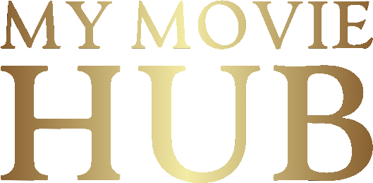

[![LinkedIn][linkedin-shield]][linkedin-url]

[Español](README-es.md)

<!-- PROJECT LOGO -->
 

                                
  
  
  <h1 align="center">MY MOVIE HUB</h1>
  

    Mobile application focused on the exploration, search and management of movies, lists and movie releases.
     
    Built with Flutter (Bloc) and the <a href="https://developer.themoviedb.org/reference/intro/getting-started">TMDB</a> API.
     
     
      <!-- <a href="https://github.com/othneildrew/Best-README-Template">View Demo</a> -->
      <!--    ·    -->
    <a href="https://github.com/davidgab98/my-movie-hub/issues">Report Bug / Request Feature</a>
  

<!-- TABLE OF CONTENTS -->

  
Table of Contents

  <ol>
    <li>
      <a href="#about-the-project">About The Project</a>
    </li>
    <li>
      <a href="#getting-started">Getting Started</a>
      <ul>
        <li><a href="#prerequisites">Prerequisites</a></li>
        <li><a href="#installation">Installation</a></li>
      </ul>
    </li>
    <li><a href="#roadmap">Roadmap</a></li>
    <li><a href="#contact">Contact</a></li>
  </ol>

<!-- ABOUT THE PROJECT -->
## About The Project

**My Movie Hub** is a mobile application developed in Flutter. It has been built under a Hexagonal architecture following the MVVM pattern. It uses the Bloc pattern for state management. Clean Architecture and Clean Clode practices have been adopted in its development, as well as SOLID principles. The Atomic Design methodology has been applied for the design and componentization of the UI.
 
 
The application integrates directly with The Movie Data Base API to provide updated data on users, movies and releases from around the world. 

### Main functionalities:

- **Movie Discovery:** browse a vast selection of movies and new releases both locally and internationally.
- **Custom Search:** find specific movies using the search and filter function.
- **Releases TimeLine:** discover current or any era's releases in your country or elsewhere.
- **List Management:** save your favorite movies in customized 'To Watch' or 'Favorites' lists. 
- **Ratings:** rate movies, review your rating history and see global ratings from other users.
- **Detailed Information:** access complete movie information, including synopsis, cast, ratings and more.
- **Connection with TMDB:** Synchronize your user with your TMDB account and keep your lists and preferences up to date.
- **Appearance:** Switch between Dark mode and Light mode.
- **Language:** Select between different languages.

**My Movie Hub** is the ultimate tool to explore, discover and organize your passion for movies. Immerse yourself in the world of cinema with instant updates and take your movie experience to a new level.

**Note:** My Movie Hub is not affiliated with, endorsed or certified by TMDB. This app is an independent project aimed at providing a rich and personalized experience for movie lovers.

---

<!-- GETTING STARTED -->
## Getting Started

### Prerequisites

### Installation

<!-- ROADMAP -->
## Roadmap

- [ ] Offline data persistence through HIVE
- [ ] Push notifications
- [ ] Home screen widgets
- [ ] Integration with other similar services such as IMDB
- [ ] Dynamic links for content sharing

Feel free to contribute:

Feel free to contribute: [open issues](https://github.com/davidgab98/my-movie-hub/issues)

<!-- CONTACT -->
## Contact

David González Íñiguez 
- Email: davidgab08@gmail.com
- Linkedin: [davidgonzaleziniguez](https://linkedin.com/in/davidgonzaleziniguez)

<!-- MARKDOWN LINKS & IMAGES -->
<!-- https://www.markdownguide.org/basic-syntax/#reference-style-links -->
[linkedin-shield]: https://img.shields.io/badge/-LinkedIn-black.svg?style=for-the-badge&logo=linkedin&colorB=555
[linkedin-url]: https://linkedin.com/in/davidgonzaleziniguez
[product-screenshot]: images/screenshot.png
[Next.js]: https://img.shields.io/badge/next.js-000000?style=for-the-badge&logo=nextdotjs&logoColor=white
[Next-url]: https://nextjs.org/
[React.js]: https://img.shields.io/badge/React-20232A?style=for-the-badge&logo=react&logoColor=61DAFB
[React-url]: https://reactjs.org/
[Vue.js]: https://img.shields.io/badge/Vue.js-35495E?style=for-the-badge&logo=vuedotjs&logoColor=4FC08D
[Vue-url]: https://vuejs.org/
[Angular.io]: https://img.shields.io/badge/Angular-DD0031?style=for-the-badge&logo=angular&logoColor=white
[Angular-url]: https://angular.io/
[Svelte.dev]: https://img.shields.io/badge/Svelte-4A4A55?style=for-the-badge&logo=svelte&logoColor=FF3E00
[Svelte-url]: https://svelte.dev/
[Laravel.com]: https://img.shields.io/badge/Laravel-FF2D20?style=for-the-badge&logo=laravel&logoColor=white
[Laravel-url]: https://laravel.com
[Bootstrap.com]: https://img.shields.io/badge/Bootstrap-563D7C?style=for-the-badge&logo=bootstrap&logoColor=white
[Bootstrap-url]: https://getbootstrap.com
[JQuery.com]: https://img.shields.io/badge/jQuery-0769AD?style=for-the-badge&logo=jquery&logoColor=white
[JQuery-url]: https://jquery.com 
